# COMPLETE GUIDE DOCKER & KUBERNETES from [STEPHEN GRIDER]

This course from Stephen teach how to create and deploy any web apps into a Web
services.

# What is Docker?

Docker is a platform or ecosystem around creating and running containers
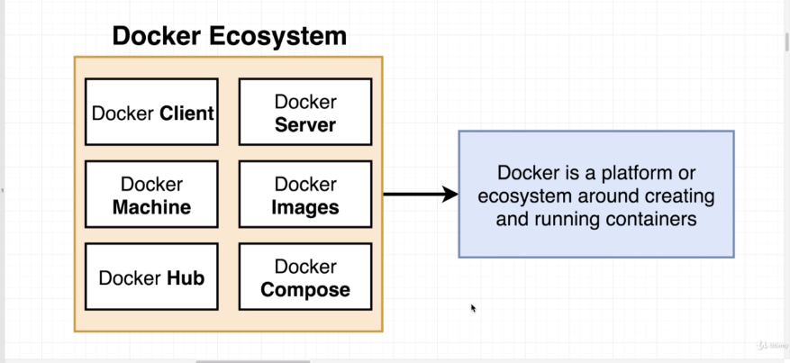

# Why use Docker?

Docker wants to make it really easy and straight forward for run software or
install in any computer as in webserver as well without worrying about all bunch
of setup or dependencies.

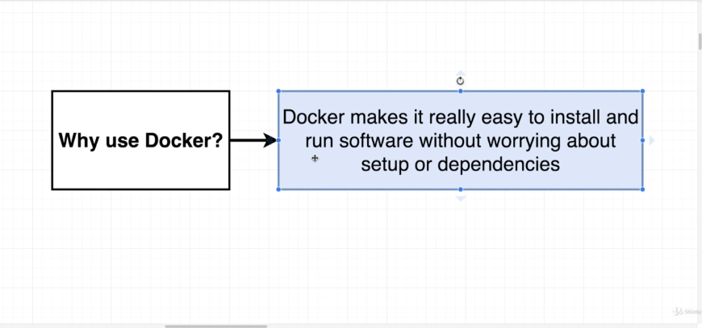

# What is an Image in Docker?

Single file with all the dependencies and config or setup required to run
a very specific program.

for example a NODEJS, NGINX, or REDIS etc

# What is a Container in Docker ?

Is a instance of an Image to runs a program.

It's a program with his own isolated set of hardware resources, it has own set
of memory, it has own space of networking technology, it has own spcae of
hard-drive.

# == Manipulating Containers with the Docker Client ==

## 001. Docker Run in Detail

eg:
~~~
docker run hello-world
~~~

## 002. Overriding Default Commands

eg:
~~~
docker run busybox echo hello world!
~~~

## 003. Listing Running Containers

eg:
~~~
docker ps

#or

docker ps --all
~~~

## 004. Container Lifecycle

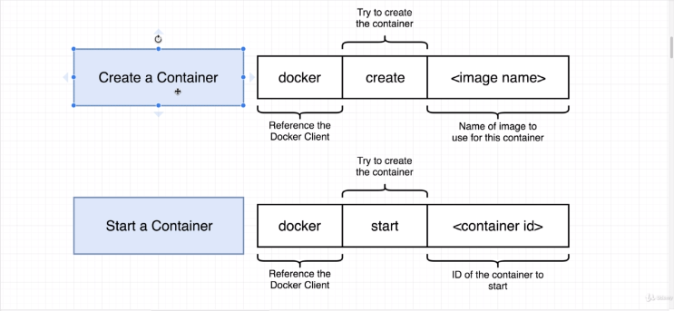

eg:
~~~
# create a container

  docker create redis

# start a container

  docker start 4b263884282
~~~

## 005. Restarting Stopped Container

eg:
~~~
docker start -a 4b263884282
~~~

## 006. Removing Stopped Containers

eg:
~~~
docker system prune
~~~

## 007. Retrieving log Outputs

eg:
~~~
docker log 4b263884282
~~~

## 008. Stopping Containers

stop command use to take more time for shutdown the container.

kill command use to shutdown the container immediately.

## 009. Multi-command Containers

we have two separate containers. we want to include redis-cli container into
redis-server container to run together

## 010. Executing Command in Running Containers

eg:
~~~
docker exec -it 4b263884282 redis-cli
~~~

## 011. The Purpose of the IT flag

When you running docker on your computer or machine every single container you
are running is running inside a virtual machine running Linux.

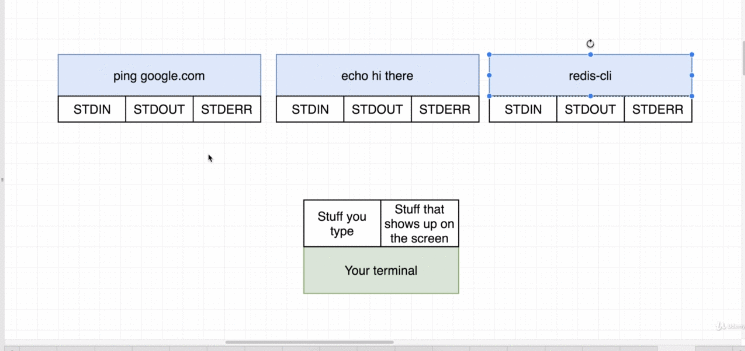

The IT flag is two separate flag

~~~
-it

# or

-i -t

 -i, --interactive          Keep STDIN open even if not attached
 -t, --tty                  Allocate a pseudo-TTY | make sure all the text nicely format | auto-complete
~~~

## 012. Getting a Command Prompt in a Container

You will not want to execute without having execute same command.

"sh" is a command processor or a shell its allow to type command in and will be
execute inside the container.

eg:
~~~
docker exec -it 4b263884282 sh
~~~

## 013. Starting with a Shell

## 014. Container Isolation

The containers do not automatically share their files system

# == Building Custom Images Through Docker Server ==

## 015. Creating Docker Images

## 016. Building a Dockerfile

[redis-image Dockerfile](./redis-image/Dockerfile)

## 017. Dockerfile Teardown

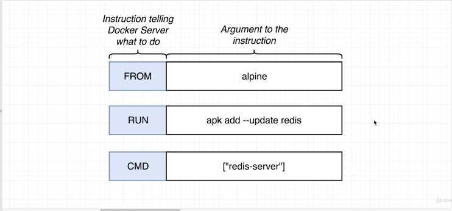

## 018. What's a Base Image

## 019. The Build Process in Details

why use new command?
~~~
docker build .
~~~

the build command it's will be use to take docker file and generating it

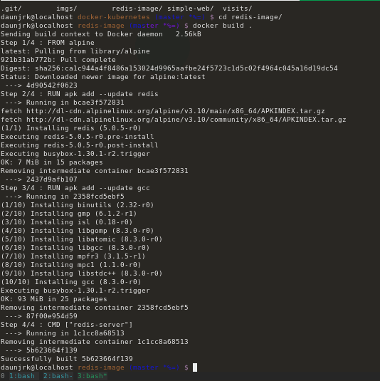

## 020. A Brief Recap

## 021. Rebuild with Cache

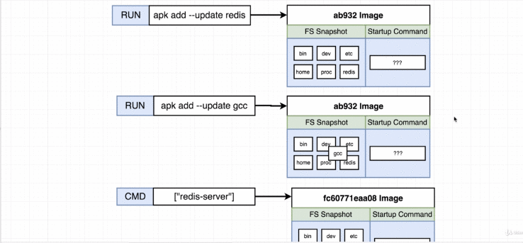

## 022. Tagging an Image

the convention to tagging an Image

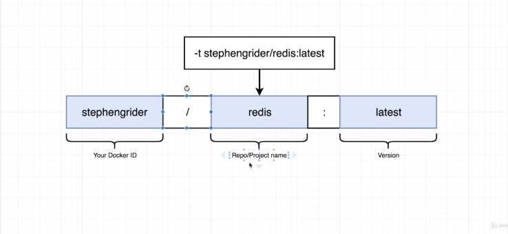

eg:
~~~
docker build -t localhost/redis:latest .

# and run

docker run localhost/redis
~~~

## 023. Manual Image Generation with Docker Commit

In common, we use image to create container. We can manually create a container
runs command inside container and generate an image. In straight word we can do
manually the same thing Dockerfile does.

eg:
~~~
# IMPORTANT YOU DON'T WANT USE THIS WAY IN GENERAL
# BETTER USE Dockerfile APPROACH

docker commit -c 'CMD["redis-server"]' 4b263884282
~~~

# == Making Real Projects with Docker ==

## 024. Making Real Projects with Docker

[simple-web](./simple-web/)

## 025. Base Image Issues

To solve the issue "npm not available on a base image"

~~~
#Dockerfile
FROM node: alpine
~~~

alpine is a term in docker role for a small incompact images. Many popular
repository were going to offer alpine version of their images.

## 027 A few Missing Files

None of the files inside your root directory are available inside the container by
default. Completely segmented out unless you specifically allowed inside your
Dockerfile.

To solve 'no such file or directory'

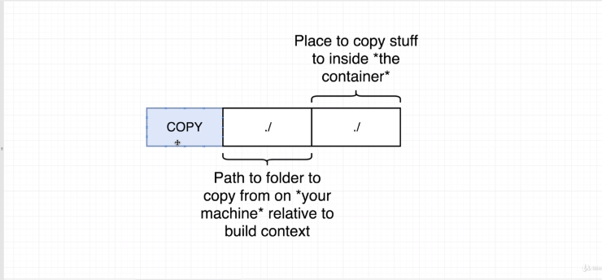

eg:
~~~
#Dockerfile
# Install some dependencies

COPY ./ ./

#Default command
.....
~~~

## 028. Container Port Mapping

We do not setup port-porting inside Dockerfile, a port-porting stuff is strictly
a run time constrain, in other words its something we only change when we run
a container or start a container.

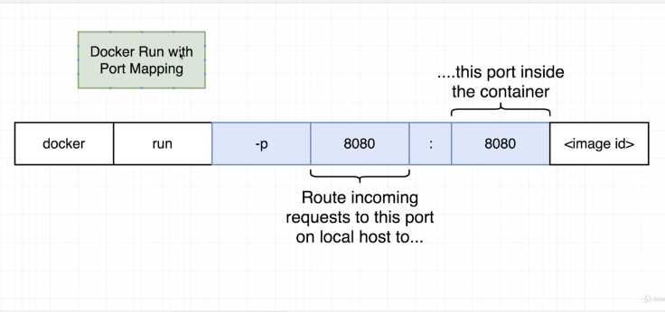

eg:
~~~
docker run -p 8080:8080 localhost/simpleweb
~~~

## 029. Specifying a Working Directory

eg:
~~~
# Dockerfile

WORKDIR /usr/app
~~~

to check the working directory is no longer in image root directory we can check by

eg:

~~~
#open 1st cli
docker run -p 5001:5001 <initial-name>/<initial-docker-container>

#open 2nd cli to check
docker exec -it <id-container> sh
~~~

## 030. Unnecessary Rebuilds
how to avoid having completely reinstall all dependencies just because we made
a change in source code file?

eg:
~~~
#Dockerfile

COPY ./package.json ./    #just copying current specify directory to WORKDIR directory
RUN npm install           # just run once

COPY ./ ./                # copy over everything else except package.json
~~~

# == Docker Compose with Multiple Local Containers ==

## 031. Introducing Docker Compose

## 032. Docker Compose Files

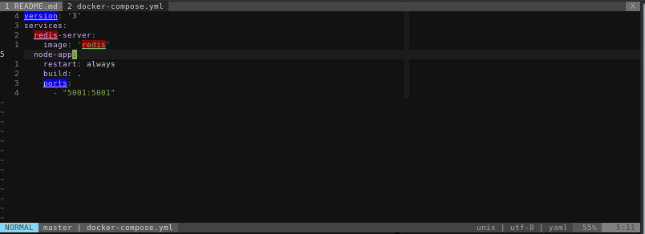

## 033. Networking with Docker

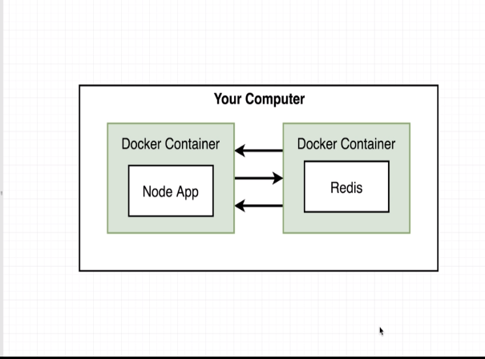

~~~
#docker-compose.yml
services:
  redis-server:     # 1st image
    image: 'redis'
  node-app:         # 2nd image
    ...
    ...
    ...

## app.js
const client = redis.createClient({
  // add docker images
  host: 'redis-server',
  // default redis-server
  port: 6379                # specify port for redis-server
});
~~~

## 034. Docker Compose Command

## 035. Stopping Docker Compose Containers

## 036. Container Maintenance with Compose

~~~
#docker-compose.yml

version: '3'
services:
  redis-server:
    image: 'redis'
  node-app:
    restart: always       # Restart Policies
    build: .
    ports:
      - "5001:5001"
~~~

## 037. Container Status with Docker Compose

eg:
~~~
#in cli with folder related docker-compose.yml
docker-compose ps
~~~

# == Creating a Production-Grade Workflow ==

## 038. Development Workflow

## 039 flow Specifics

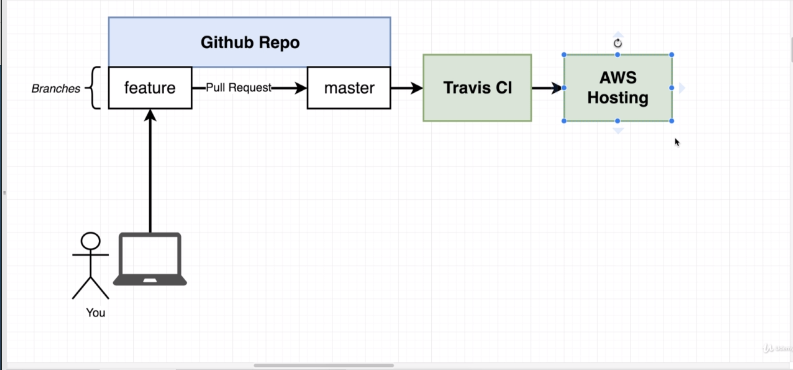

## 040. Docker Purpose

## 041. Creating the Dev Dockerfile

eg:
~~~
#create Dockerfile.dev in root folder directory

#run in cli
docker build -f Dockerfile.dev -t "<images-name>/<container-name>:latest" .    # -f is stand for looking a specify Dockerfile
~~~

## 042. Duplicating Dependencies

to solve this problem, just delete __node_modules__ on root folder.

~~~
.
├── node_modules    # Delete this for avoid duplicate files in images
├── public
└── src
~~~

## 043. Docker Volumes

~~~
-v $(pwd):/app

-v        # volume list | Bind mount a volume
$(pwd)    # pwd stand of "present working directory"
:/app     # when we use a ":" we want to map out a folder inside the container to the folder outside container

-v /app/node_modules  # just a placeholder for the folder that's inside the container
~~~

## 044. Shorthand with Docker Compose

## 045. Live Updating Tests

~~~
# open 1st cli
docker-compose up   # to build an image

# open 2nd cli
docker ps   # to copy the run CONTAINER-ID

docker exec -it <container-id> npm run test
~~~

## 046. Docker Compose for Running Tests

~~~
# docker-compose.yml
# add this code
version "3"
  services:
  ....
  ....
  ....
  # for test purpose
  test:
    build:
      context: .
      dockerfile: Dockerfile.dev
    volumes:
      - /app/node_modules
      - .:/app
    # override command to run test
    command: ["npm", "run", "test"]

# run cli
docker-compose up --build
~~~

## 047. Multi-Step Docker Build for Production environment

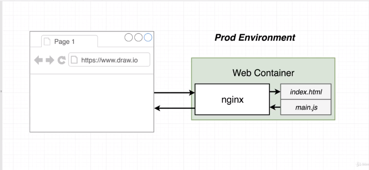

but we have an issue here,

so we make two different images to solve this issue.

## 048. Implementing Mutli-Step build

[Dockerfile for production env](./frontend/Dockerfile)

## 049. Running Nginx

