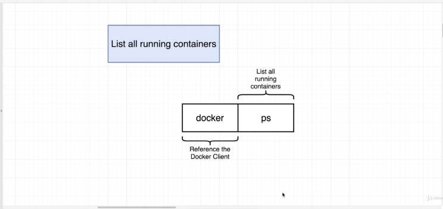
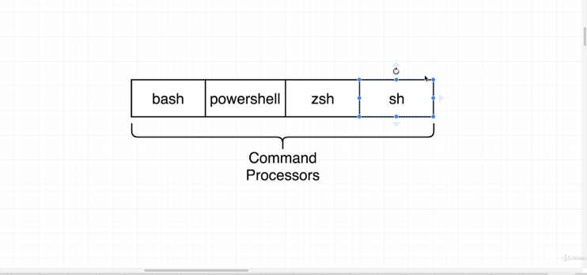

# COMPLETE GUIDE DOCKER & KUBERNETES from [STEPHEN GRIDER]

This course from Stephen teach how to create and deploy any web apps into a Web
services.

# What is Docker?

Docker is a platform or ecosystem around creating and running containers

# Why use Docker?

Docker wants to make it really easy and straight forward for run software or
install in any computer as in webserver as well without worrying about all bunch
of setup or dependencies.

# What is an Image in Docker?

Single file with all the dependencies and config or setup required to run
a very specific program.

for example a NODEJS, NGINX, or REDIS etc

# What is a Container in Docker ?

Is a instance of an Image to runs a program.

It's a program with his own isolated set of hardware resources, it has own set
of memory, it has own space of networking technology, it has own spcae of
hard-drive.

# 001. Docker Run in Detail

eg:
~~~
docker run hello-world
~~~

# 002. Overriding Default Commands

eg:
~~~
docker run busybox echo hello world!
~~~

# 003. Listing Running Containers

eg:
~~~
docker ps

#or

docker ps --all
~~~

# 004. Container Lifecycle

eg:
~~~
# create a container

  docker create redis

# start a container

  docker start 4b263884282
~~~

# 005. Restarting Stopped Container

eg:
~~~
docker start -a 4b263884282
~~~

# 006. Removing Stopped Containers

eg:
~~~
docker system prune
~~~

# 007. Retrieving log Outputs

eg:
~~~
docker log 4b263884282
~~~

# 008. Stopping Containers

stop command use to take more time for shutdown the container.

kill command use to shutdown the container immediately.

# 009. Multi-command Containers

we have two separate containers. we want to include redis-cli container into
redis-server container to run together

# 010. Executing Command in Running Containers

eg:
~~~
docker exec -it 4b263884282 redis-cli
~~~

# 011. The Purpose of the IT flag

When you running docker on your computer or machine every single container you
are running is running inside a virtual machine running Linux.

The IT flag is two separate flag

~~~
-it

# or

-i -t

 -i, --interactive          Keep STDIN open even if not attached
 -t, --tty                  Allocate a pseudo-TTY | make sure all the text nicely format | auto-complete
~~~

# 012. Getting a Command Prompt in a Container

You will not want to execute without having execute same command.

"sh" is a command processor or a shell its allow to type command in and will be
execute inside the container.

eg:
~~~
docker exec -it 4b263884282 sh
~~~

# 013. Starting with a Shell

# 014. Container Isolation

The containers do not automatically share their files system

# 015. Creating Docker Images

# 017. Building a Dockerfile

[redis-image Dokcerfile](./redis-image/Dockerfile)
